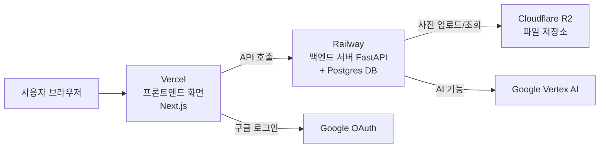

# Surplus Hub 배포 따라하기 가이드 (완전 초보용 · 떠먹여주기 버전)

> **이 문서의 목적**: 클라우드 배포를 한 번도 안 해본 사람도, **화면 클릭 순서 그대로 따라 하면** 배포가 끝나도록.
> 어려운 자동화 부분(서버 세팅·DB 마이그레이션·환경변수 주입)은 **Claude Code가 대신** 합니다. 당신이 할 일은 **"계정 만들고 토큰(비밀번호 같은 열쇠) 5개 복사해오기"** 뿐입니다.
> **작성일** 2026-07-19 · **함께 보는 문서** 자동 실행 대본은 `docs/DEPLOYMENT_PLAN.md`

---

## 0. 큰 그림 — 우리가 뭘 만드는가

이 서비스는 부분이 3개로 나뉘고, 각각 다른 무료(또는 거의 무료) 클라우드에 올립니다.



| 조각 | 올라가는 곳 | 하는 일 | 돈 |
|---|---|---|---|
| 화면(프론트) | **Vercel** | 사용자가 보는 웹사이트 | 무료 |
| 서버(백엔드) + DB | **Railway** | 데이터 처리, 로그인, 검색 | 트라이얼 무료 → 이후 월 $5 |
| 사진/파일 | **Cloudflare R2** | 자재 사진 저장 | 무료(10GB) *카드 등록 필요* |
| 구글 로그인 | **Google Cloud** | 구글 계정 로그인 | 무료 |
| AI(추천/검색) | **Google Vertex AI** | 이미 세팅됨(`service-account.json` 보유) | 사용량 과금 |

> **핵심**: 당신은 위 서비스들에 **가입하고 "토큰"이라는 열쇠 값을 복사**만 하면 됩니다. 그 값을 터미널에 붙여넣고 Claude Code에게 "배포해"라고 하면 끝.

---

## 1. 시작 전 준비물 (딱 이것만)

- [ ] **신용카드/체크카드 1장** — Railway·Cloudflare 가입 시 등록 필요 (한도 안 넘으면 청구 0원이거나 월 $5 수준)
- [ ] **구글 계정** (<goopy684@gmail.com> 그대로 사용 가능)
- [ ] **깃허브 계정** (goopy684 — 이미 로그인돼 있음)
- [ ] **시간** — 계정 만들고 토큰 복사에 약 30~40분, 이후 자동 배포 약 1시간
- [ ] **메모장 하나 열어두기** — 복사한 토큰 값들을 잠깐 붙여둘 곳 (배포 끝나면 지우세요)

> 💡 **토큰이 뭔가요?** 비밀번호 대신 프로그램이 쓰는 긴 비밀 문자열입니다. 절대 남에게 보여주면 안 됩니다(깃허브·채팅에 붙여넣기 금지). 이 가이드에서 복사하는 값은 전부 "내 컴퓨터 터미널에만" 붙여넣습니다.

---

## STEP 0. 🛠️ 먼저: 버그픽스 코드 합치기 (5분)

방금 고친 운영 버그 2건이 PR로 올라가 있습니다. **배포 전에 이걸 먼저 `main`에 합쳐야** 배포되는 서버가 고쳐진 코드로 돕니다.

1. 브라우저에서 열기 → **<https://github.com/goopy684/surplus-hub-api-v3/pull/5>**
2. 초록색 체크(✓, CI 통과)가 뜰 때까지 잠깐 기다립니다. (빨간 X면 아래 "트러블슈팅 T0" 참고)
3. **`Merge pull request`** 버튼 클릭 → **`Confirm merge`** 클릭.
4. 끝. 이제 백엔드 `main`에 고쳐진 코드가 들어갔습니다.

---

## STEP 1. 🔑 GitHub 토큰 (이미 됐을 수도 있음 · 3분)

> 터미널에서 `gh auth status` 쳤을 때 "Logged in to github.com account goopy684"가 나오면 **이 단계는 건너뛰어도 됩니다.** 그래도 대본이 토큰을 확인하니, 안전하게 발급해두는 걸 권장.

1. 접속 → **<https://github.com/settings/tokens/new>** (Classic 토큰 발급 화면)
2. **Note(이름)**: `surplus-deploy` 라고 입력
3. **Expiration(만료)**: `30 days`
4. **Select scopes(권한)**: 아래 2개 체크박스에 ✓
   - ☑ `repo`
   - ☑ `workflow`
5. 맨 아래 **`Generate token`** 버튼 클릭
6. `ghp_` 로 시작하는 긴 값이 뜹니다 → **복사** (이 화면 벗어나면 다시 못 봄!)
7. 메모장에 이렇게 적어두기:

   ```
   GH_TOKEN=ghp_여기에_복사한_토큰_붙여넣기
   ```

---

## STEP 2. 🚂 Railway (백엔드 서버 + DB) (7분)

### 2-1. 가입

1. 접속 → **<https://railway.com>**
2. **`Login`** → **`Login with GitHub`** 클릭 → 깃허브 계정(goopy684)으로 로그인/승인
3. 처음이면 이메일 인증·간단한 설문이 나올 수 있습니다. 넘어가면 됩니다.

### 2-2. 결제수단 등록 (필수)
>
> Railway는 무료 영구 플랜이 없습니다. 처음엔 **$5 무료 크레딧(30일)**을 주고, 이후엔 **Hobby 플랜 월 $5**(카드 필요)입니다. 사용량이 적으면 그 $5 안에서 대부분 커버됩니다.

1. 왼쪽 아래 프로필 → **`Account Settings`** → **`Billing`** (또는 `Plans`)
2. **`Add Payment Method`** → 카드 정보 입력
3. (선택) **Hobby** 플랜으로 업그레이드. 트라이얼로 먼저 테스트하고 싶으면 지금은 건너뛰고 나중에 해도 됩니다.

### 2-3. API 토큰 발급

1. 접속 → **<https://railway.com/account/tokens>**
2. **`Create Token`** (또는 `New Token`) 클릭
3. 이름: `surplus-deploy`, 팀/계정 범위는 기본값 그대로
4. **`Create`** → 뜨는 값 **복사** (한 번만 보임)
5. 메모장에:

   ```
   RAILWAY_TOKEN=여기에_복사한_토큰_붙여넣기
   ```

---

## STEP 3. ▲ Vercel (프론트엔드 화면) (5분)

### 3-1. 가입

1. 접속 → **<https://vercel.com/signup>**
2. **`Continue with GitHub`** 클릭 → 깃허브(goopy684)로 로그인/승인
3. "Hobby(개인용, 무료)" 선택 → 이름 등 물어보면 대충 채우고 진행

### 3-2. 토큰 발급

1. 접속 → **<https://vercel.com/account/tokens>**
2. **`Create Token`** 클릭
3. **Token Name**: `surplus-deploy`
4. **Scope**: 본인 계정(개인) 선택
5. **Expiration**: `30 days` 정도
6. **`Create`** → 뜨는 값 **복사**
7. 메모장에:

   ```
   VERCEL_TOKEN=vcp_여기에_복사한_토큰_붙여넣기
   ```

---

## STEP 4. ☁️ Cloudflare R2 (사진 저장소) (8분)

> 자재 사진을 저장할 곳. 무료 10GB지만 **카드 등록이 있어야 활성화**됩니다(한도 안 넘으면 청구 0원).

### 4-1. 가입 + R2 활성화

1. 접속 → **<https://dash.cloudflare.com/sign-up>** → 이메일/비번으로 가입 → 이메일 인증
2. 로그인 후 왼쪽 메뉴에서 **`R2 Object Storage`** (또는 `R2`) 클릭
3. **`Purchase R2`** / **`Add payment method`** 안내가 나오면 → 카드 등록해서 R2 활성화 (요금제는 무료 티어 그대로 두면 됩니다)

### 4-2. 파일 접근용 API 토큰(= S3 자격증명) 발급 ★가장 헷갈리는 부분★

1. R2 화면에서 오른쪽 위 **`Manage R2 API Tokens`** (또는 `API` → `Manage API Tokens`) 클릭
2. **`Create API Token`** 클릭
3. **Token name**: `surplus-uploads`
4. **Permissions**: **`Object Read & Write`** 선택
5. **Specify bucket(s)**: `Apply to specific buckets only` → 버킷 이름에 **`surplus-hub-uploads`** 라고 그냥 타이핑
   (이 버킷은 아직 없어도 됩니다. Claude Code가 나중에 이 이름으로 만들 거예요. 이름만 정확히 적으면 됨.)
6. **`Create API Token`** 클릭
7. 여기서 **3개 값**이 한 번에 나옵니다. 전부 **복사**:
   - **Access Key ID** → `R2_ACCESS_KEY_ID`
   - **Secret Access Key** → `R2_SECRET_ACCESS_KEY`
   - **Endpoint** (아래 "Use jurisdiction-specific endpoints for S3 clients" 밑, `https://<긴숫자>.r2.cloudflarestorage.com` 형태) → `R2_ENDPOINT`
8. 메모장에:

   ```
   R2_ACCESS_KEY_ID=여기에_Access_Key_ID_붙여넣기
   R2_SECRET_ACCESS_KEY=여기에_Secret_Access_Key_붙여넣기
   R2_ENDPOINT=https://여기에_계정ID.r2.cloudflarestorage.com
   ```

> 💡 **Endpoint가 안 보이면**: R2 첫 화면의 오른쪽에 "S3 API" 주소로도 표시됩니다. `계정ID.r2.cloudflarestorage.com` 형태면 맞습니다.

---

## STEP 5. 🔓 Google 로그인용 클라이언트 ID (10분)

> "구글로 로그인" 버튼을 쓰기 위한 열쇠. 비밀번호(secret)는 필요 없고 **Client ID 하나**만 있으면 됩니다.

### 5-1. 프로젝트 선택

1. 접속 → **<https://console.cloud.google.com>**
2. 화면 맨 위 프로젝트 선택 드롭다운에서 **기존 프로젝트 `est-alan-451902`** 를 고릅니다. (AI 기능이 이미 이 프로젝트를 씁니다. 재사용하면 편함.)

### 5-2. OAuth 동의 화면 설정 (처음 1회만)

1. 왼쪽 메뉴 → **`APIs & Services`** → **`OAuth consent screen`**
2. 이미 설정돼 있으면 이 단계는 건너뜀. 없으면:
   - **User Type**: `External` 선택 → `Create`
   - **App name**: `Surplus Hub`, **User support email**: `goopy684@gmail.com`
   - **Developer contact**: `goopy684@gmail.com`
   - 나머지는 기본값 → `Save and Continue` 를 끝까지 눌러 완료

### 5-3. 클라이언트 ID 발급

1. 왼쪽 메뉴 → **`APIs & Services`** → **`Credentials`**
2. 상단 **`+ Create Credentials`** → **`OAuth client ID`** 클릭
3. **Application type**: **`Web application`**
4. **Name**: `Surplus Hub Web`
5. **Authorized JavaScript origins** → **`+ Add URI`** 로 아래 2개 추가:
   - `http://localhost:4000`  ← 로컬 개발용
   - `http://localhost:3000`  ← 혹시 몰라 하나 더
   > ⚠️ 진짜 배포 주소(`https://...vercel.app`)는 **아직 모릅니다.** 배포가 끝나면 **STEP 10**에서 다시 와서 추가할 거예요. 지금은 localhost만.
6. **`Create`** 클릭 → **Client ID** (`.apps.googleusercontent.com` 로 끝남) **복사**
7. 메모장에:

   ```
   GOOGLE_OAUTH_CLIENT_ID=131608276147-kb4767ioo2ip0uq1k3944eu7u9890oc9.apps.googleusercontent.com
   ```

---

## STEP 6. ✉️ (선택) 비밀번호 재설정 메일 (SMTP) — 지금 안 해도 됨

이메일로 "비밀번호 찾기"를 보내려면 SMTP가 필요합니다. **없어도 서비스는 정상 동작**하고, 메일만 안 갑니다. 급하지 않으면 건너뛰세요.

나중에 하려면 (예: Gmail 앱 비밀번호 또는 SendGrid) 이 값들을 준비:

```
SMTP_HOST=smtp.gmail.com
SMTP_PORT=587
SMTP_USER=goopy684@gmail.com
SMTP_PASSWORD=앱비밀번호
EMAILS_FROM_EMAIL=goopy684@gmail.com
```

---

## STEP 7. ✅ GCP 서비스 계정 (이미 있음 — 확인만)

AI 기능용 열쇠 파일이 이미 있습니다: `~/dev/owner/service-account.json`

- 터미널에서 확인: `ls -la ~/dev/owner/service-account.json`
- 파일이 보이면 **아무것도 안 해도 됩니다.** Claude Code가 알아서 씁니다.

---

## STEP 8. 📋 모아둔 값 한 번에 붙여넣기

메모장에 모은 값들을 아래 틀에 채워서, **터미널(하나의 창)에 통째로 복사→붙여넣기→엔터**. 이 창을 닫지 말고 그대로 Claude Code를 실행하세요(같은 창의 환경변수를 물려받습니다).

```bash
# ===== 필수 5종 =====
export GH_TOKEN='ghp_...'
export RAILWAY_TOKEN='...'
export VERCEL_TOKEN='...'
export R2_ACCESS_KEY_ID='...'
export R2_SECRET_ACCESS_KEY='...'
export R2_ENDPOINT='https://xxxxxxxx.r2.cloudflarestorage.com'
export GOOGLE_OAUTH_CLIENT_ID='xxxx.apps.googleusercontent.com'

# ===== (선택) SMTP — STEP 6 안 했으면 생략 =====
# export SMTP_HOST='smtp.gmail.com'
# export SMTP_PORT='587'
# export SMTP_USER='goopy684@gmail.com'
# export SMTP_PASSWORD='...'
# export EMAILS_FROM_EMAIL='goopy684@gmail.com'
```

> 값은 **작은따옴표 `'...'`** 로 감싸세요(특수문자 안전). 붙여넣은 뒤 아래로 잘 들어갔는지 확인:
>
> ```bash
> for v in GH_TOKEN RAILWAY_TOKEN VERCEL_TOKEN R2_ACCESS_KEY_ID R2_SECRET_ACCESS_KEY R2_ENDPOINT GOOGLE_OAUTH_CLIENT_ID; do
>   printf '%-25s ' "$v"; [ -n "${!v}" ] && echo "✓ 있음" || echo "✗ 비었음"; done
> ```
>
> 전부 `✓ 있음` 이면 준비 완료.

---

## STEP 9. 🚀 Claude Code에게 넘기기 (한 줄)

같은 터미널에서 Claude Code를 켠 뒤, 이렇게만 말하세요:

> **"`surplus-hub-react/docs/DEPLOYMENT_PLAN.md` 따라 배포해줘."**

그럼 Claude Code가 대본대로 자동 진행합니다:

- Cloudflare에 버킷 `surplus-hub-uploads` 생성 + CORS 설정
- Railway에 서버 + Postgres(pgvector) 생성 + 환경변수 주입 + 배포 + DB 마이그레이션
- Vercel에 프론트 배포 + 환경변수 주입
- 백엔드 CORS에 Vercel 주소 등록
- 헬스체크·자동 검증까지

중간에 딱 한 번, **DB(pgvector) 관련 질문**이 나올 수 있습니다(Railway Postgres가 pgvector를 못 켜는 경우). 그때 Claude Code가 **Supabase 무료 DB**로 대체하는 방법을 안내합니다 — 시키는 대로 따라오면 됩니다.

---

## STEP 10. 🔁 배포 끝난 뒤: Google 로그인에 진짜 주소 추가 (3분)

배포가 끝나면 Vercel 주소(예: `https://surplus-hub-react.vercel.app`)가 정해집니다. 구글 로그인이 그 주소에서 작동하려면 등록이 필요합니다.

1. 접속 → **<https://console.cloud.google.com>** → **`APIs & Services`** → **`Credentials`**
2. 아까 만든 **`Surplus Hub Web`** 클릭
3. **Authorized JavaScript origins** → **`+ Add URI`** → 실제 Vercel 주소 붙여넣기:
   - `https://surplus-hub-react.vercel.app` (본인 실제 주소로!)
4. **`Save`**
5. (반영까지 몇 분 걸릴 수 있음) 사이트에서 구글 로그인 테스트.

> ⚠️ 구글은 `*.vercel.app` 같은 와일드카드를 origins에 못 넣습니다. **정확한 전체 주소**를 넣어야 합니다.

---

## STEP 11. 👀 내 눈으로 확인 (검증)

Claude Code가 자동 검증도 하지만, 직접 눈으로도 확인하세요.

1. **백엔드 살아있나** — 브라우저에서 열기: `https://<railway주소>/health`
   - 이렇게 보이면 정상: `{"status":"ok","checks":{"api":"ok","database":"ok"}}`
   - `"database":"error"` 면 DB 연결 문제 → 트러블슈팅 T2
2. **프론트 열리나** — `https://<vercel주소>` 접속 → 홈 화면에 "잉여자재" 같은 글자가 보이면 OK
3. **로그인 되나** — 회원가입/로그인 시도. 구글 버튼은 STEP 10 후 작동.
4. **사진 업로드 되나** — 자재 등록에서 사진 첨부 → 저장 → 목록에 사진 뜨면 R2까지 정상.
5. **관리자 페이지** — 관리자 계정으로 로그인 후 `https://<vercel주소>/admin` 접속 → 대시보드·사용자 관리 화면 확인.
   (백엔드 직접 편집기: `https://<railway주소>/admin` — 슈퍼관리자용)

---

## 🩹 트러블슈팅 (사용자 관점)

| 번호 | 증상 | 해결 |
|---|---|---|
| **T0** | PR #5에 빨간 X(CI 실패) | Claude Code에게 "PR #5 CI 실패 원인 봐줘"라고 하면 진단·수정합니다. |
| **T1** | 화면은 뜨는데 로그인/데이터가 안 됨, 브라우저 콘솔에 `CORS` 오류 | 백엔드가 프론트 주소를 아직 모름. Claude Code에게 "CORS에 Vercel 주소 넣고 재배포해"라고 요청. |
| **T2** | `/health`에서 `database:error`, 모든 페이지 오류 | DB 미연결/마이그레이션 안 됨. Claude Code에게 "Railway DB 마이그레이션 돌려줘"라고 요청. |
| **T3** | 구글 로그인 눌러도 오류(`redirect_uri`/`origin` 관련) | STEP 10 안 함, 또는 주소 오타. Credentials에서 정확한 Vercel 주소 다시 확인. |
| **T4** | 사진 업로드 실패(403) | R2 토큰 권한(Object R&W)·CORS 문제. Claude Code에게 "R2 CORS/토큰 점검해"라고 요청. |
| **T5** | Railway 빌드가 `Killed`(메모리 부족) | 트라이얼 리소스 부족. Hobby로 업그레이드하거나 Claude Code에게 워커 수 줄이라고 요청. |
| **T6** | 토큰을 실수로 공개(깃허브/채팅에 붙임) | 즉시 해당 서비스에서 그 토큰 **삭제(Revoke)** 후 재발급. |

자세한 원인별 대처는 `DEPLOYMENT_PLAN.md` §9(트러블슈팅 플레이북)에 표로 더 있습니다.

---

## 💰 비용 요약 (2026-07 기준)

| 서비스 | 무료 범위 | 초과 시 |
|---|---|---|
| **Vercel** | 개인(Hobby) 무료, 대역폭 월 100GB | 초과분 과금 또는 Pro |
| **Railway** | 트라이얼 $5 크레딧(30일) → 이후 **Hobby 월 $5**(카드 필수) | 사용량이 $5 초과 시 그만큼 추가 |
| **Cloudflare R2** | **영구 무료** 저장 10GB·나가는 트래픽 0원 | 10GB 초과분만 소액 |
| **Google Vertex AI** | 사용량 과금(임베딩·생성) | 토큰 사용량만큼 |
| **Google OAuth** | 무료 | — |

> **결제 알림 걸어두기**(권장): Railway `Billing`에서 사용량 알림, Google Cloud는 `Billing → Budgets & alerts`에서 예: 월 $10 도달 시 메일. 예상치 못한 과금 방지.

---

## ⏪ 문제 생기면 되돌리기 (롤백)

- **프론트(Vercel)**: 대시보드 → `Deployments` → 이전 배포 → `Promote to Production`
- **백엔드(Railway)**: 대시보드 → 서비스 → `Deployments` → 이전 배포 → `Redeploy`
- **DB 스키마**: Claude Code에게 "alembic 한 단계 되돌려줘" 요청

---

## 📌 다음(선택 · 출시 후)

- **내 도메인 연결** (예: `app.surplushub.kr`): 도메인을 사면 `DEPLOYMENT_PLAN.md` §8 따라 연결.
- **에러 추적(Sentry)·DB 자동 백업**: `DEPLOYMENT_PLAN.md` §11. 출시 1주차에 Claude Code에게 요청.

---

## ✅ 한눈에 보는 체크리스트

- [ ] STEP 0 — PR #5 머지
- [ ] STEP 1 — `GH_TOKEN`
- [ ] STEP 2 — Railway 가입 + 카드 + `RAILWAY_TOKEN`
- [ ] STEP 3 — Vercel 가입 + `VERCEL_TOKEN`
- [ ] STEP 4 — Cloudflare R2 + 카드 + `R2_ACCESS_KEY_ID`/`R2_SECRET_ACCESS_KEY`/`R2_ENDPOINT`
- [ ] STEP 5 — `GOOGLE_OAUTH_CLIENT_ID` (localhost origins)
- [ ] STEP 7 — `service-account.json` 있는지 확인
- [ ] STEP 8 — 터미널에 `export` 전부 + 확인 스크립트 `✓`
- [ ] STEP 9 — Claude Code에 "DEPLOYMENT_PLAN.md 따라 배포해"
- [ ] STEP 10 — 배포 후 Google origins에 실제 Vercel 주소 추가
- [ ] STEP 11 — /health · 홈 · 로그인 · 업로드 · /admin 눈으로 확인
